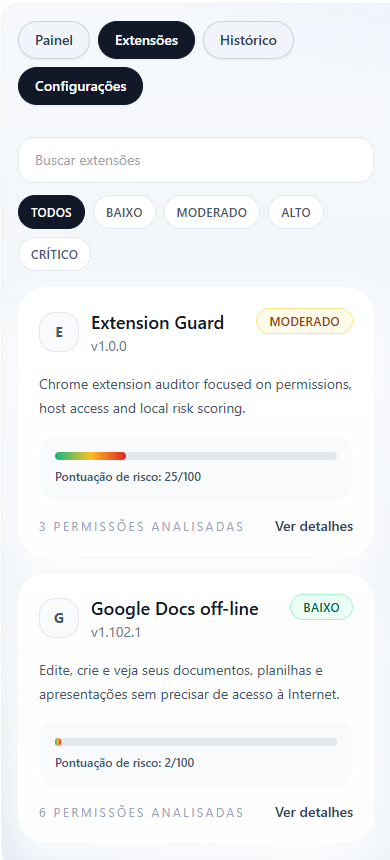

# Extension Guard


Extensão Chrome desenvolvida para auditoria local de extensões instaladas, com foco em arquitetura limpa, análise heurística de permissões, interface profissional no Side Panel e persistência de histórico local.

A proposta do projeto vai além de um MVP visual: a base foi pensada para demonstrar organização arquitetural, separação de responsabilidades, tipagem forte, testabilidade e uma abordagem de produto voltada para segurança e clareza de uso.

Extensão do Chrome Reagir TypeScript Vite Vitest Status

🔗 Chrome Web Store: [Ver extensão](https://chromewebstore.google.com/detail/jihknbnaipjpaeffdmpfiiicpmmlkjdb)

## Sobre o Projeto

O **Extension Guard** foi construído para inspecionar extensões instaladas no navegador e ajudar o usuário a entender, de forma simples e visual, o nível de risco associado a permissões e acessos sensíveis.

A análise acontece localmente, sem backend, sem autenticação e sem dependência de serviços externos. Isso torna a solução mais enxuta, privada e adequada para um MVP de extensão Chrome baseado em `Manifest V3`.

Além da listagem das extensões instaladas, o projeto entrega:

- classificação heurística de risco;
- explicações textuais sobre permissões;
- recomendações com base no nível de exposição;
- histórico local de auditorias;
- painel lateral com experiência mais executiva e organizada.

## Preview

### Visão geral da interface


### Cartões e resumo do ambiente


### Tela de extensões auditadas



> Depois, se quiser, esse preview pode evoluir para GIF, vídeo curto ou imagens adicionais da tela de detalhes e configurações.

## 🏛️ Arquitetura e Princípios de Design

Este projeto foi estruturado com foco em organização profissional, facilidade de manutenção e crescimento futuro.

Mesmo sendo uma extensão Chrome, a arquitetura evita acoplamento excessivo à API do navegador e separa claramente domínio, UI, persistência, adapters e orquestração. Isso facilita evolução do produto, testes e refatorações futuras.

### Estrutura de Pastas

```text
extension-guard/
  public/
    icons/
    manifest.json
  src/
    app/
      sidepanel/
      popup/
      options/
    background/
    chrome/
      adapters/
      mappers/
    core/
      constants/
      domain/
      services/
      use-cases/
    storage/
      repositories/
    shared/
      hooks/
      lib/
      ui/
      utils/
    tests/
      unit/
      integration/
      component/
  docs/
    images/
  package.json
  vite.config.ts
  tailwind.config.ts
  README.md
```

### Responsabilidade de cada área

- `public/`: manifesto da extensão e ícones.
- `src/app/`: entradas visuais do produto para side panel, popup e options.
- `src/background/`: service worker, listeners e handlers do Manifest V3.
- `src/chrome/`: adapters para APIs do Chrome e mapeamento de dados externos.
- `src/core/`: regras centrais do negócio, domínio, constantes, services e use-cases.
- `src/storage/`: repositories para persistência local em `chrome.storage.local`.
- `src/shared/`: componentes reutilizáveis, hooks, schemas e utilitários.
- `src/tests/`: testes unitários, de integração e de componente.
- `docs/`: imagens da documentação.

## Princípios Aplicados

### SOLID

A organização foi guiada principalmente por separação de responsabilidades e redução de acoplamento.

- `SRP (Single Responsibility Principle)`: cada módulo possui um papel claro.
- `RiskEngine.ts` concentra a lógica de score heurístico.
- `RecommendationEngine.ts` cuida da recomendação textual.
- `GetInstalledExtensions.ts` orquestra a obtenção e análise das extensões.
- `SettingsRepository.ts` e `AuditHistoryRepository.ts` abstraem a persistência local.

### Clean Code

O código foi escrito com foco em legibilidade, previsibilidade e clareza de intenção. Isso aparece em nomes descritivos, funções pequenas, contratos explícitos e baixa concentração de lógica dentro da UI.

### Separação de Responsabilidades

A interface React não contém regra de negócio. A lógica de análise e decisão fica centralizada em `services` e `use-cases`, enquanto `adapters` isolam o acesso às APIs do Chrome.

### Contratos Tipados com TypeScript

As entidades e mensagens foram modeladas com TypeScript, o que melhora consistência, previsibilidade e segurança nas integrações entre interface, background e persistência.

### Validação com Zod

A entrada de dados, especialmente em configurações e estruturas persistidas, é validada com `Zod`, reduzindo riscos de inconsistência em runtime.

### Testabilidade

A estrutura foi desenhada para permitir testes em diferentes níveis, cobrindo regra de negócio, orquestração e interface.

## 🛠️ Tecnologias e Justificativas

| Tecnologia | Área | Por que foi escolhida? |
| --- | --- | --- |
| Chrome Manifest V3 | Extensão | É o padrão atual para extensões Chrome modernas, com service worker e modelo mais seguro. |
| React 19 | Frontend | Permite construir uma interface modular, reutilizável e organizada. |
| TypeScript | Projeto inteiro | Garante tipagem forte, contratos explícitos e melhor manutenção. |
| Vite | Build | Oferece setup moderno, rápido e adequado para múltiplas entradas da extensão. |
| Tailwind CSS | UI | Agiliza a construção visual mantendo consistência e produtividade. |
| Zod | Validação | Valida contratos de dados com segurança e clareza. |
| Vitest | Testes | Solução moderna, rápida e integrada ao ecossistema do Vite. |
| React Testing Library | Testes | Incentiva testes orientados ao comportamento do usuário. |
| ESLint | Qualidade | Ajuda a manter consistência e prevenir erros comuns. |
| Prettier | Padronização | Mantém formatação uniforme em todo o projeto. |
| Husky + lint-staged | Qualidade | Reforça disciplina no fluxo de alterações. |
| chrome.storage.local | Persistência | Permite armazenamento local simples, nativo e adequado ao MVP. |

## ✨ Funcionalidades

- Listagem das extensões instaladas no Chrome.
- Leitura de permissões e `host permissions`.
- Cálculo de score heurístico de risco de `0` a `100`.
- Classificação em `baixo`, `moderado`, `alto` e `crítico`.
- Recomendações contextuais com base nos sinais encontrados.
- Dashboard com resumo executivo e métricas principais.
- Filtros por risco e busca por nome da extensão.
- Tela de detalhes com motivos do risco e leitura das permissões.
- Configurações persistidas localmente.
- Histórico local de auditorias.
- Popup com acesso rápido ao painel lateral.

## 💼 Habilidades Demonstradas Neste Projeto

- Estruturação de uma extensão Chrome com `Manifest V3` e múltiplas entradas.
- Arquitetura em camadas com separação clara entre UI, domínio, adapters, repositories e background.
- Modelagem de entidades e contratos com TypeScript.
- Implementação de heurística de risco orientada à explicabilidade.
- Persistência local com repositórios dedicados.
- Construção de interface React com foco em clareza visual e escalabilidade.
- Uso de `Zod` para validação de estruturas persistidas e mensagens.
- Escrita de testes unitários, de integração e de componente.
- Preocupação com legibilidade, manutenção e evolução futura do produto.

## 🧠 Regras de Risco Implementadas

O motor de risco atual trabalha com um modelo heurístico simples, transparente e facilmente ajustável.

### Faixas de classificação

- `0 a 24`: baixo
- `25 a 49`: moderado
- `50 a 74`: alto
- `75 a 100`: crítico

### Pesos iniciais

| Regra | Peso |
| --- | --- |
| `<all_urls>` | `+30` |
| `management` ou `scripting` | `+15` |
| `tabs` | `+8` |
| `storage` | `+2` |
| 8 ou mais permissões | `+10` |
| extensão desabilitada | `-5` |
| `installType = development` | `+8` |

## 🧭 Fluxo da Aplicação

O fluxo principal da extensão funciona assim:

1. A interface envia uma mensagem com `chrome.runtime.sendMessage`.
2. O `service-worker` recebe e valida a mensagem.
3. O handler correspondente delega ao use-case.
4. O use-case consulta adapters e repositories.
5. Os services calculam score, motivos e recomendação.
6. O retorno volta para a interface.
7. O histórico pode ser salvo localmente para futuras auditorias.

## 🏁 Começando

Siga os passos abaixo para rodar o projeto localmente.

### Pré-requisitos

- Node.js 18+
- npm
- Google Chrome compatível com Manifest V3

### Instalação

```bash
npm install
```

### Ambiente de desenvolvimento

```bash
npm run dev
```

> Para extensões Chrome, o fluxo principal continua sendo gerar a build e carregar a pasta final no navegador. O modo `dev` ajuda na iteração local da interface durante o desenvolvimento.

### Build de produção local

```bash
npm run build
```

## ✅ Testes e Validações

### Rodar testes

```bash
npm run test
```

### Rodar testes em modo watch

```bash
npm run test:watch
```

### Rodar lint

```bash
npm run lint
```

### Formatar o projeto

```bash
npm run format
```

### Validar build

```bash
npm run build
```

## 🔌 Como carregar no Chrome

Depois de gerar a build:

1. Abra `chrome://extensions`
2. Ative o **Modo do desenvolvedor**
3. Clique em **Carregar sem compactação**
4. Selecione a pasta `dist`

### Entradas geradas no bundle

- `background/service-worker.js`
- `src/app/sidepanel/index.html`
- `src/app/popup/index.html`
- `src/app/options/index.html`

## 🧪 Testes Automatizados Implementados

- `src/tests/unit/RiskEngine.test.ts`: valida o cálculo de score heurístico.
- `src/tests/unit/PermissionExplainer.test.ts`: valida a explicação de permissões conhecidas e desconhecidas.
- `src/tests/unit/RecommendationEngine.test.ts`: valida recomendações contextuais por risco.
- `src/tests/integration/RunAudit.test.ts`: valida a composição de auditorias.
- `src/tests/integration/SaveSettings.test.ts`: valida persistência de configurações.
- `src/tests/component/ExtensionCard.test.tsx`: valida renderização do card de extensão.
- `src/tests/component/DashboardPage.test.tsx`: valida resumo executivo e lista crítica.

## 🚀 Evoluções Futuras

- adicionar comparação entre auditorias antigas e atuais
- mostrar mudanças de permissões entre snapshots
- permitir ignorar extensões diretamente pela interface
- enriquecer ainda mais a análise heurística por categoria
- adicionar exportação local dos resultados
- incluir testes adicionais para hooks e handlers
- preparar pipeline de CI com lint, test e build automatizados

## 👤 Contato

Desenvolvido para compor portfólio e demonstrar arquitetura limpa, organização por camadas, tipagem forte, testes automatizados e desenvolvimento de extensão Chrome moderna.

- LinkedIn: [www.linkedin.com/in/luanagroth](https://www.linkedin.com/in/luanagroth)
- GitHub: [github.com/Luanagroth](https://github.com/Luanagroth)
- E-mail: [luanaeulalia56@gmail.com](mailto:luanaeulalia56@gmail.com)

